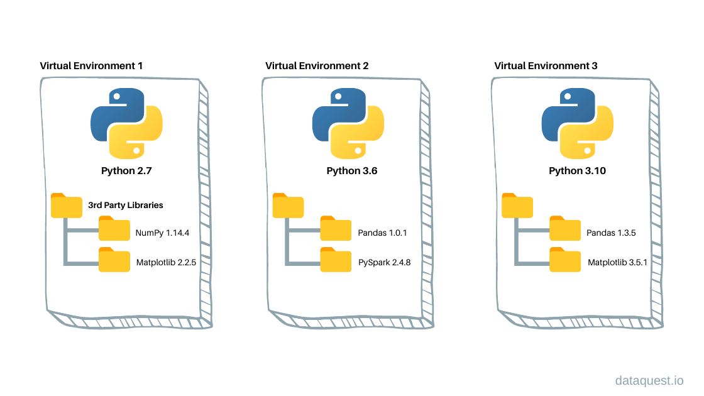

# Installation of MEGqc

Now we'll start with the installation process for MEGqc. Before diving in, we'll briefly explain virtual environments and containerization:
 

## Virtual environments
Virtual environments create isolated and sel-contained workspaces, allowing us to manage project-specific dependencies separatedly from system-wide installation. This isollation has several benefits:
- **Avoid dependency conflicts:** prevents interferences between project-specific and system-wide dependenciesm, such as common erors related to version mismatches.
- **Transparency and Open Science:** Ensures that others can replicate your results and reproduce your analysis reliably.

To create and activate your virtual environment, follow these steps:
1. Navigate to the directory where you want to create the environment using the `cd` command in the terminal.
2. Create the virtual environment:

        python3 -m venv <your_environment_name>

3. Activate the virtual environment:

        source /path/to/environment/bin/activate

<!--
### Python Environment

MEG QC has compatiblity issues with older Python versions (prior to 3.9), therefore it's necessary to upgrade your Python version. Environments allows one to work with specific versions of Python itself without affecting other projects within the same network or the OS itself.

**[pyenv](https://github.com/pyenv/pyenv)** is a simple python version management. It let's you easily swtich between multiple versions of Python. In their github you can find the instruction to install pyenv, create your own environment with your desired Python version and activate it. 
-->

## Install the MEGqc Package
Once your environment is activated, you can install Python packages with `pip`, and these installations will only apply to your virtual environment. To install MEGqc core functionality, run the following command in the terminal:
 
        pip install  meg_qc

 

<!--
Next, you will need to clone the [Github Repository](https://github.com/ANCPLabOldenburg/MEGqc). 

- The folder _docker_ contains the starting script *run_megqc.py*.
- The folder *meg_qc* is a copy of the previously installed MEGqc package via `pip`.
-->

## Install depencies?
Thanks to the last update, it's not necessary to manually pip install the different dependencies anymore. All of them are installed automatically along with the MEGqc package.
If you want to know more about them and their functionalitiy, please [visit the pipeline basics page](~/details.md).

Still, if your python version is older than 3.9, it might be necessary to upgrade pandas to 2.2.3 version:

        pip install --upgrade pandas.
