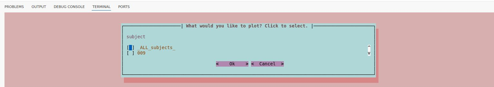

# Running the plotting module
After completing the analysis with the calculation module, the next step is to generate the visual reports. Below are the methods to run the plotting module.

## Automatic Mode
Once the calculation module has completed the analysis, the terminal will display where can you find your `derivatives` folder. 

        /path/to/your/dataset/derivatives/Meg_QC/calculation

Then in the terminal will ask you if `Do you want to run the MEGqc plotting module on the MEGqc results? (y/n)`. Entering **y** will automatically start the plotting module.

## Manual Mode
To run the plotting module manually, use the following command in your terminal including a filepath to your root dataset folder, MEGqc will find the derivatives folder within the dataset.

        run-megqc-plotting --inputdata </path/to/your/dataset/>

## Interactive GUI
After a short wait, the terminal will ask you several questions about specific parameters. The available options depend on the metadata in your dataset:
- Subjects: ALL or a specific one
- Sessions: ALL or a specific one
- Tasks: ALL or a specific one
- Runs: ALL or a specific one
- Metrics: ALL or a specific one
- Sensors: ALL, or only magnetometers or gradiometers

## Congratulations!
You're done'! The HTML reports are now available in the `derivatives` folder of your dataset:

        /path/to/your/dataset/derivatives/Meg_QC/reports/subject
        
Open these reports in Chrome or Firefox to explore the interactive plots and visualize of the quality control analysis of your dataset!

<!--

OLD VERSION
As you can see, the calculation module generates numerous metadata files. But what if we want the data to be neatly organized and presented in a visual and interactive way?

Luckily MEGqc also contains the plotting module, which generates the HTML reports we saw earlier. Let's see how can we produce them:

## Setting File Paths

First, locate the script *meg_qc_plots.py* within the `plotting`folder in the `meg_qc` package, which is located in the `site-packages` folder of your environment. The path might look like this:

        /path/to/environment/lib/python3.9/site-packages/meg_qc/plotting/

Open the *meg_qc_plots.py*, and at the very last line where **tsvs_to_plot=** is defined, add your path to your dataset (e.g., ds003483). The line should look similar to this:

        tsvs_to_plot = make_plots_meg_qc(ds_paths=['/path/to/dataset/'])

## Running the plotting module

Ensure that you are working within your environment and then run the script from the command line. The command might look like:

        python3 /path/to/environment/lib/python3.9/site-packages/meg_qc/plotting/meg_qc_plots.py

