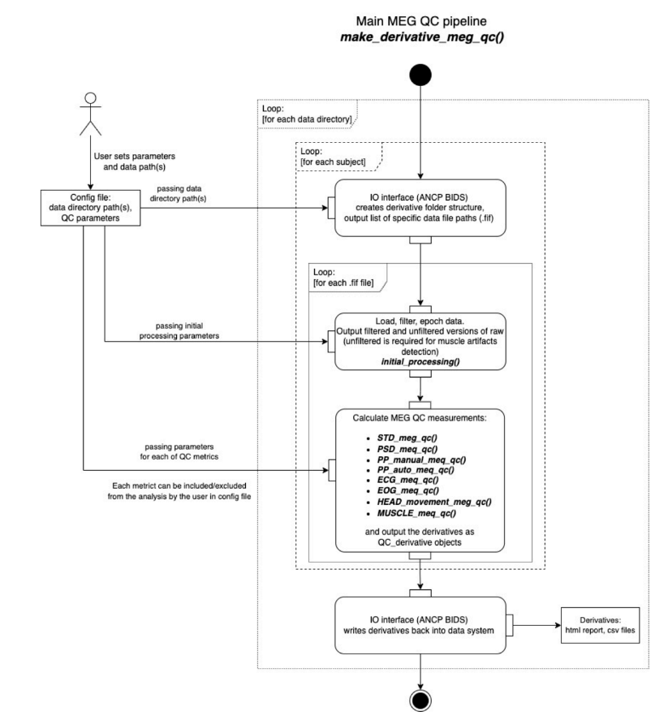

# Introduction to MEGqc

## MEG data quality control
Magnetoencephalography (MEG) data is susceptible to  noise and artifacts, which can severely corrupt the data quality. These artifacts may arise from:
- Environmental noise sources (e.g. powerline noise)
- Internal noise sources (e.g. eye movements of the subject)
- Systemic noise sources (e.g. malfunction of a sensor).

For this reason, quality control of MEG data is an essential step for ensuring valid and reproducible science (Niso et al., 2022).  
However, the visual detection and annotation of artifacts in MEG data requires expertise, and still can be:
- A tedious and time-consuming task
- Commonly performed manually
- Vulnerable to biases
- Not standardized 

To address this issue, the ANCP lab developed the MEGqc, a software tool for automated and standardized quality control of MEG recordings. By providing a standardized workflow, it helps minimize human bias and facilitates comparisosn between datasets.

*(disclaimer: fragment adapted from MEGQc github)* 

## MEGqc
Evaluates the quality of raw data, but is **not** an artifact removal tool. The MEGqc pipeline is designed to be user-friendly, so researches only need to:
- Provide data for evaluation
- Set analysis parameters if desired (default parameters are available), and 
- Run the analysis script.

### Metrics in MEG QC
The different  calculation modules within MEGqc are called ***metrics*** and they are used to evaluate specific types of artifacts or aspects of data quality. There are six independent metrics:
- **Standard Deviation calculation**
- **Power Spectral Density calculation**
- **Peak-to-Peak manual calculation**
- **ECG (Electrocardiogram)and EOG (Electrooculography) calculation:** it produces 2 reports
- **Muscle artifacts calculation**
   

There are 2 other metrics within MEG QC:
- **Peak-to-Peak automatic calculation:** This module, which relies on MNE library functions, is not used in the final version of the pipeline. Instead, the manual "Peak-to-Peak manual" is recommended.
- **Head movement calculation:** This module functions, but requires extensive head position data.

To ensure standardization of the pipeline, MEGqc software is tailored to the **BIDS standards**.

## MEGqc derivatives  
MEGqc produces two types of machine-readable outputs:
- **JSON files*** with the key information for each of the quality metrics.
- **TSV files**** with more detailed results for some of the metrics.

To ensure the clarity of the results, the pipeline includes a **plotting module** that generates visual HTML reports based on the TSV files. For each metric, an html report is created (6 in total). The next section will delve in the kind of information included within each report. The output also maintains the **BIDS standards.**

# What is BIDS?

Neuroimaging experiments result in complex data that can be arranged in many different ways, and for a long time, there was no consensus on how to organize and share data obtained in neuroimaging experiments. **Brain Imaging Data Structure (BIDS)**, describes a simple and easy to adopt way of organizing neuroimaging and behavioral data (Gorgolewski et al., 2016; Niso et al., 2018) facilitating collaboration between researches and saving time and effort.  _(fragment adapted from BIDS official website)._ 

BIDS describes the structure of the data, directories and sub-directories, name-structure, file-naming and file formats. MEGqc uses **ancpBIDS**, a Python library which facilitates working with BIDS, both for identifiying the files and also for writting the results according to BIDS. 

Gapontseva (2023) evaluated the MEGqc software thanks to 21  MEG datasets obtained from the OpenNeuro data library. [OpenNeuro](https://openneuro.org/) is a free and open platform with more than 50 thousand participants and more than one thousand public BIDS compliant MRI, PET, MEG, EEG and iEEG datasets. 

## General Pipeline Stucture

The following figure (Gaponsetva, 2023) describes the general process of the pipeline. It might look  a bit overwhelming, but we won't go too much into detail:

The time is on the Y axis, from top to bottom: 

- The **configuration** file contains the data directory path and the parameters for the selected metrics. Default values for all metrics are preset, but they can be modified as needed.
- Data files are identified thanks to ancpBIDS.
- Datasets are loaded and **early processed:** epoching, resampling and filtering (taking into account users' parameters).
- Selected **metrics** are executed (taking into account users' parameters) and results compiled into the **derivatives**.
- ancpBIDS writes the **derivatives** to the dataset directory, maintaining BIDS naming convention.

    

### Next section
In the next section, we'll walk through the content of the HTML reports.       
        
        
---

* *json file: A JSON (JavaScript Object Notation) file is a lightweight data format that stores structured data in a readable, text-based format using key-value pairs, arrays, and nested objects.*  
* **tsv file: A TSV (Tab-Separated Values) file is a simple text file that stores tabular data, with each line representing a row and each value in the row separated by tab characters.*  
