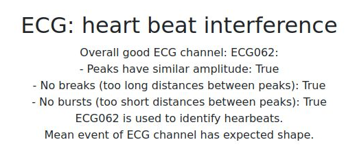
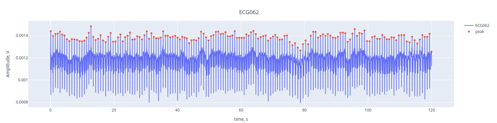
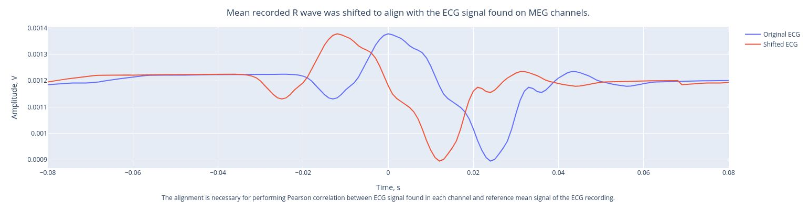
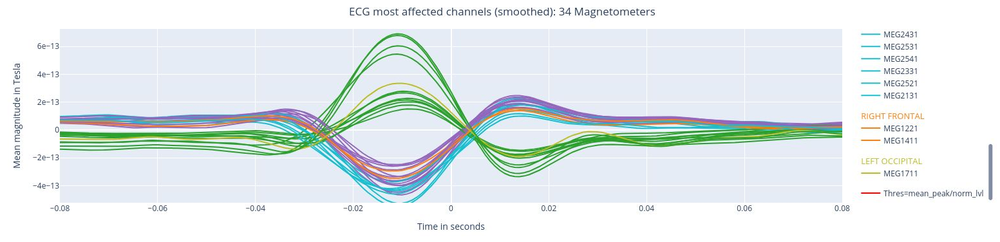
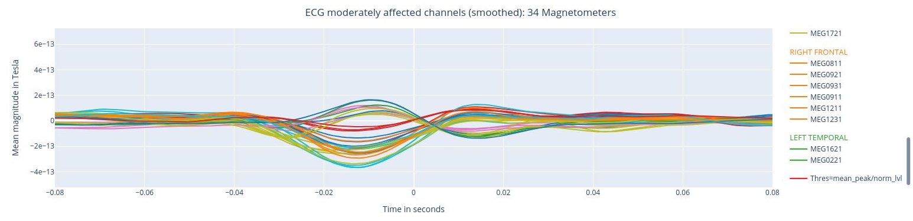
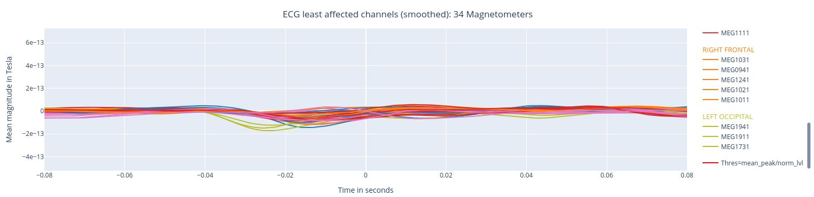
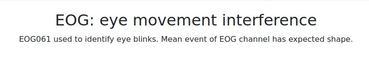
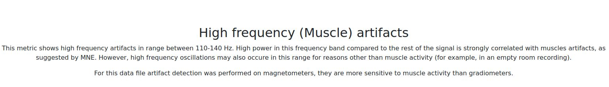

### about the MEGQc html report:

All the figure produced by MEGQc report are interactive; as you scroll through them, you can zoom in and out, reveal the legend on hover, hide/show specific epochs or channels within a specific region just by clicking...  
Unfortunately, this interactive feature is lost in this tutorial, as we'll work with screenshots. If you want to explore ther interactive feature by yourself, you can download [here](https://cloudsync.uol.de/s/TA65Q4sRYcCBtKC) the full document that we're going to use in this preview. Once downloaded, you can open it up in your internet browser (such as Google Chrome or Firefox) but it might need a bit of time as the plots are dynamically generated by Java.

## Metrics
### Raw Information

The report starts with the summary details extracted from a class MNE Raw object. The Raw object represents the data before preprocessing or analysis and it contains metadata about the structure such as channel details (which one is ECG or EOG), acquisition parameters (sampling frequency, duration) and so on. This metadata can indicate potential issues with the data, such as a too low sampling frequencies, issues with the filters applied during recording, available channels, etc.

### Sensors positions

This is a visual representation of the spatial distribution of MEG sensors on the subject's head. If you hover over a sensor dot (in the interactive .html) it displays 3 different identifiers:
- 1 Magnetometer: names end with '1' like 'MEG1011'. They measure the magnetic field directly, providing data on its strength and direction. They are more sensitive to distant source, so they are more vulnerable to external magnetic noise.
- 2 Gradiometers: names end with '2' and '3' like 'MEG0112' and 'MEG0113'. These sensors measure the gradient of the magentic field, so the difference between 2 measuremenets. It filters out environemntal noise.

The sensors are divided into eight color-coded groups representing different head regions. A careful inspection can help you identify missing or orddly placed sensors.

## Standard deviation of the data

The Standard Deviation provides an overview of the variability from the recorded signal and it allows us to identify outliers among the sensors. There are 2 sets of 4 different plots: one for the Magnetometers and a second one for Gradiometers. Here we'll just overview the set for Magnetometers. 

### Standard deviation of the data for Magnetometers over the entire time series
In this box plot every dot represents the standard deviation for a single sensor. The sensors are colored following the region distribution of the previous plot. If you hover over the dot you'll see the standard deviation value. You can also deactivate or activate sensors from specific brain regions. The position of the points on the Y axis are not meaningful, they are just for visualization purposes.     
If a dot falls outside of the whiskers, it means that that specific sensor might be a potentital outlier over the entire time series.     

### Standard deviation over sensors for Magnetometers

Each box plot in this figure corresponds to a channel or sensor, and each point represents the standard deviation for that sensor during an individual epoch. These epochs are created by segmenting the continuous MEG recording basend on triggers in the dataset. The time window for each epoch is defined within the settings. By hovering over any of the points, users can read the specific epoch represented. 
This plot helps asses the variability of each sensor's signal across different time windows (epochs). Sensors with points outside the whiskers indicate higher variability, potential artifacts or irregularities in specific epochs. 

  

The lower horizontal bar at the bottom allows users to zoom in on a subset of sensors. This feature enables a closer examination of how the standard deviation changes within 6 sensors of the Left Frontal area across all epochs.

### Standard deviation over epochs for Magnetometers

Each box plot represents the standard deviation for all sensors within a single epoch. Each dot show the standard deviation value for every specific sensor during that epoch. The sensors are colour coded following the sensor location first figure.  
This type of figure is most relevant for experiments with relevant time events.  

Once again, we can use the horizontal bar at the bottomw to zoom in on a subset of sensors. This visualization helps to visually detect in 5 periods where multiple sensors had an increased variability.  

We can make interpretations or especulate if outliers might be due to muscle activity, external noise or transient artifacts, but MEG Qc only reports these anomalies.  
As it was mentioned before, this set of figures gets repeated for Gradiometers.

## Power Spectrum Density

  

## Peak to Peak Manual Calculation

## ECG: heart beat interference

## EOG: eye movement interference

## High frequency (Muscle) artifacts

