# MEGqc report overview

Every metric in MEGqc generates its own HTML report. In this section, we will provide an overview of these reports. These figures are interactive: you can zoom in and out, reveal legends on hovering, hide or show specific epochs or channels... While this tutorial primarly uses screenshots, we've included some GIFs to demonstrate the interactive capabilities of the figures.

The examples in this section are taken from the report of the subject 009 from the  _ds003483_ dataset available on OpenNeuro. This same dataset was used by Gaponsertva (2023) to evaluate the MEGqc tool. In the Practical Guide you'll learn how to [download this same dataset](guide/dataset.md), so you can recreate these same reports yourself.

## Raw Information

The report starts with metadata about the original raw file, before filtering and resampling. This metadata includes some general information (date, experimenter...), some channels' information (more on that later), and some data information (sampling frequency, applied filters...).

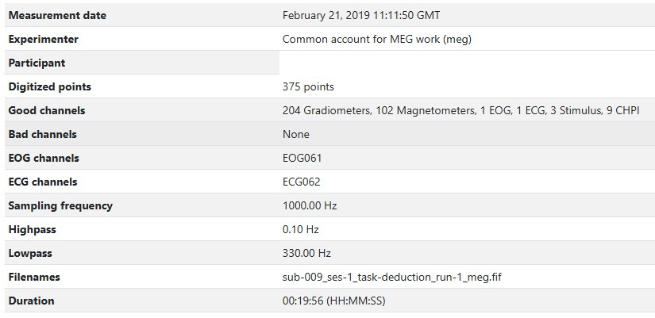

## Sensor Positions

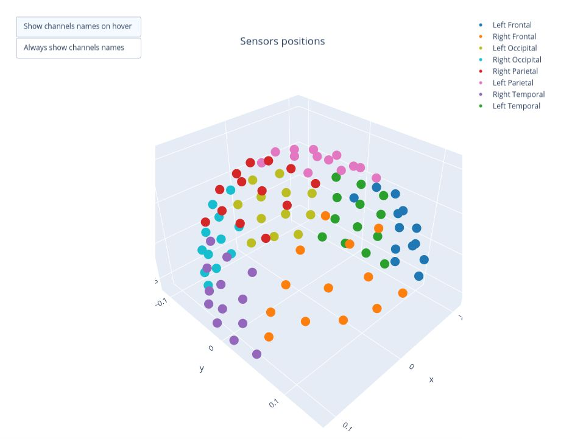

Almost every report starts with this visual representation of the spatial distribution of MEG sensors on the subject's head. The sensors are divided into eight color-coded groups representing different lobes. This same color coding will be used frequently throughout the reports for reference.

1. **Rotate the figure**
By clicking and holding the mouse left-button while dragging, you can rotate the sensor positions figure to view it from different angles.

![rotation]](static/gifs/01_sensor_location/01_rotation.gif)

2. **Hide and reveal sensors**
By clicking on the legend block, you can hide the sensors of a specific lobe. Clicking the block again will make the sensors reappear.

![hide]](static/gifs/01_sensor_location/02_hide.gif)

There are 2 different types of meters in MEG sensors: **Magnetometers** and **Gradiometers**. Each sensor might contain one type of meter or both. The sensor labels help you distinguish between them:
- **Magnetometer:** it measures the magnetic field directly, providing data on its strength and direction. It is more sensitive to distant source, making it more vulnerable to external magnetic noise. Its label ends with _"1"_ (e.g., _MEG1011_ ).
- Gradiometers: These sensors come in pairs and they measure the gradient of the magentic field, so the difference between 2 measurements. This setup helps filter out environemntal noise. Their labels end with _"2"_ and _"3"_ indicating the two Gradiometers in a specific sensor (e.g. _MEG0112_ and _MEG0113_).

The sensor labels appear when you hover over a  sensor dot. Alternatively, you can enable _"Always show channels names"_ option, which keeps all labels visible. Enabling this feature might take some time to render, specially if all lobes are visible.

![hide]](static/gifs/01_sensor_location/03_labels.gif)

## Metrics

Each report might include two sets of results: one for the Magnetometers and another set for the Gradiometers. This tutorial focuses on Magnetometers, but the Gradiometers results follow the same logic.
### Standard deviation of the data

The Standard Deviation (STD) metric measures the variability of each channel. Channels with unusual high or low STD compared to others, might indicate potential malfunctions (Gapontseva, 2023).

#### 1. Standard Deviation over the entire time series
In the first figure, each dot represents the standard deviation of a Magnetometer channel over **the entire time series**.

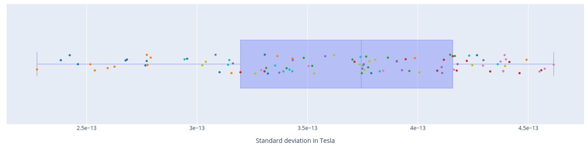

- The sensors are colored according to the regions of the Sensor Distribution plot.
- The position of the points on the Y axis are not meaningful, they are just for visualization purposes. 

Interactive features:
- Hovering over a dot reveals the standard deviation value of a specific sensor and the sensor label (e.g. 3.62e-13 | _MEG1741_). - Hovering over the blue square gives you the value of:
    - The highest and lowest edge values of the boxplot's whisker: any data point outside that range is flagged as **noisy** or **flat**, indicating a potential outlier.
    - The first quartile (Q1) and the third quartile (Q3), which represents the 25th and 75th percentile of the data.
    - The media (50th percentile) value of the dataset.

- Clicking on the legend box allows you to hide or reveal sensors of a specific lobe. 

- Clicking, holding and dragging the left mouse button over a section of the figure allows to you zoom in. The home button restores the default view.

#### 2. standard Deviation over Sensors

Each box plot corresponds to a sensor, and each point represents the standard deviation for that sensor during an individual epoch.

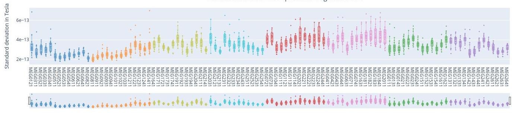  

Epochs are created by segmenting the continuous MEG recording basend on triggers in the dataset. By hovering over any of the points, users can read the specific epoch represented. Sensors with points outside the whiskers indicate higher variability, potential artifacts, or irregularities in specific epochs. 

Interactive features:

1. Selecting lobes
- Clickin once on a legend block hides a group of sensors.
- Clicking again reveals the previously hidden sensors.
- Clicking twice isolates that group.

2. Scrolling through lobes
- Rich-click and drag on the horizontal bar to scroll though the sensors, enabling a more detailed view. This feature might be a bit slow when many sensors are displayed simultaneously.

- For example, the following figure shows 6 sensors from the Left Frontal area.

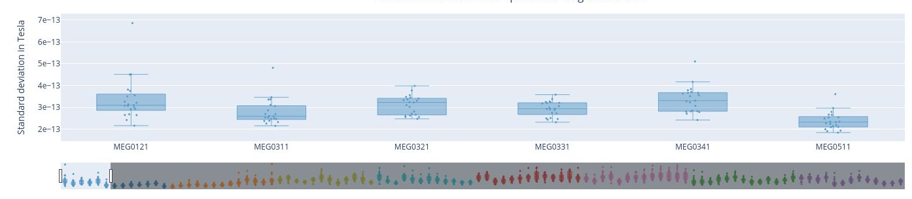

#### 3. Standard Deviation over Epochs
Each box plot represents a single epoch, and each dot the standard deviation value for every specific sensor during that epoch. The sensors are color coded.  
This type of figure is most relevant for experiments with relevant time events.  

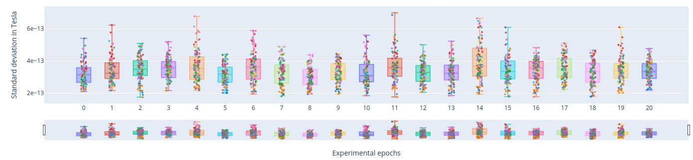

- To zoom in, use the horizontal bar at the bottom to zoom in on a subset of sensors. This visualization helps to visually focus on a subsets of epochs.  

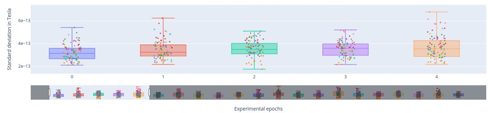

- Hovering over with the mouse, the value and label of every sensor appears, along with the interquartile range values. 

### Power Spectrum Density

The Power Spectrum Density describes how the power of a signal is distributed across different frequencies. It provides information on the strength or intensity of different frequency components. PSD calculation helps us to distinguish between brain activity and non-brain-related noise (Gapontseva, 2023).  

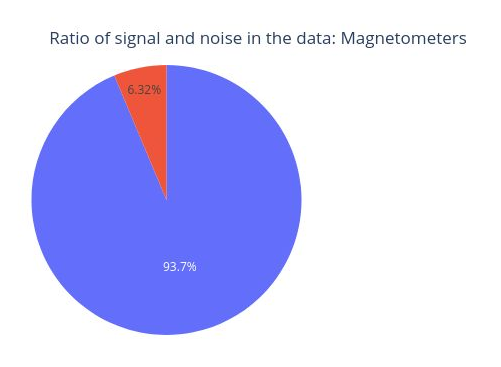  
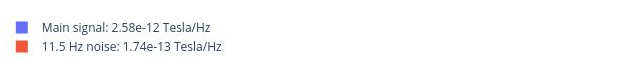

This circle chart represents the Signal-to-Noise Ratio (SNR). A high SNR indicates minimal corruption of the signal of interest by background noise. The prominent amplitude of the 11.5 Hz frequency labels it as potential noise.

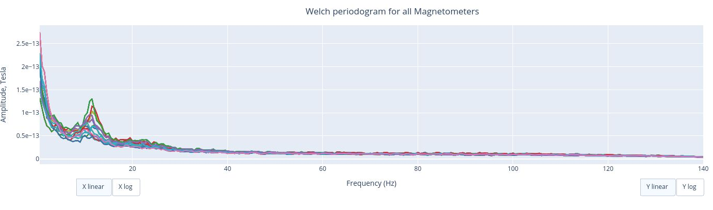

The Welch periodrogram is commonly used to estimate the power of a signal at different frequency components.  
The X-axis represents the frequency range of the signal (from 0 to 140 Hz in this case) and the Y-axis represents the amplitude of the signal. 
Each colored line represents the PSD for the different magnetometers. As it was previously reported, there's a visible peak at 11.5 Hz in this example.

Interactive features in the HTML report allow toggling between linear a **linear** view or a **logarithmic** view of both the X-axis and the Y-axis independently. 

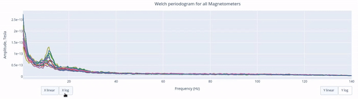
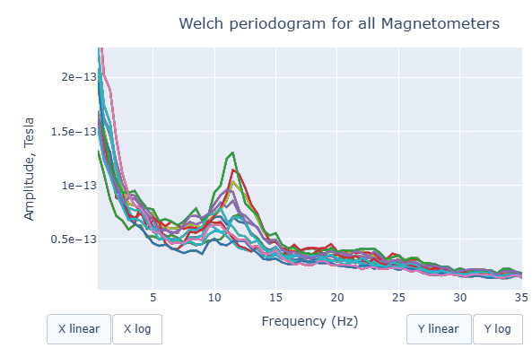

Also you can select from the legend box which sensors to show / hide (one click) or isolate on the figure (2 clicks).
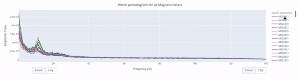

Finally, each segment of the following circle chart represents the proportion of the total signal power that falls within each frequency range. How much does every frequency band contribute to the overall signal. 

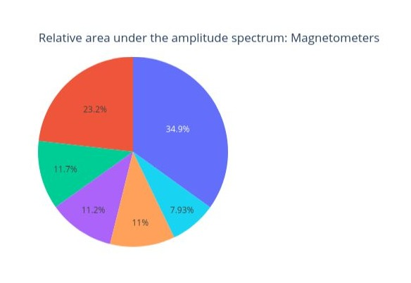
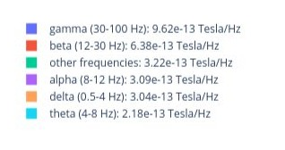

### Peak to Peak Amplitude
Peak-to-Peak (PtP) amplitude refers to the difference between the highest positive peak and the lowest negative peak. It provides a measue of the total range of variation of the data averaged over a time interval (Gapontseva, 2023). 

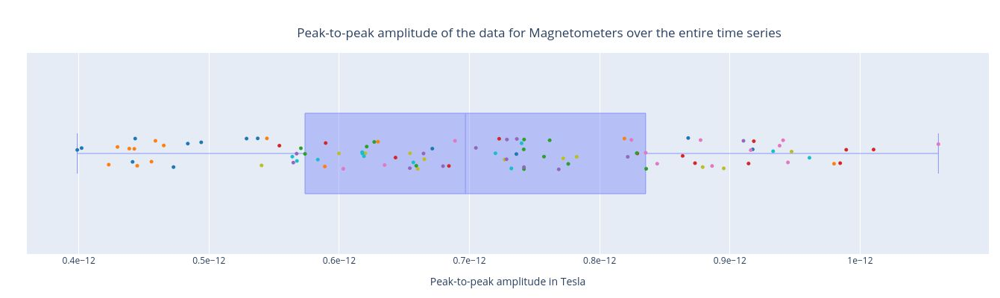

The PtP amplitude of the data over the entire time series represents how the PtP amplitude of every sensor varies over the entire time series. Every dot represent the PtP amplitude of a single sensor. If a sensor falls outside of the whiskers area, it might indicate that the sensor is malfunctioning or other issues.

The position in the Y Axis is not meaningful but serves visualization purposes.

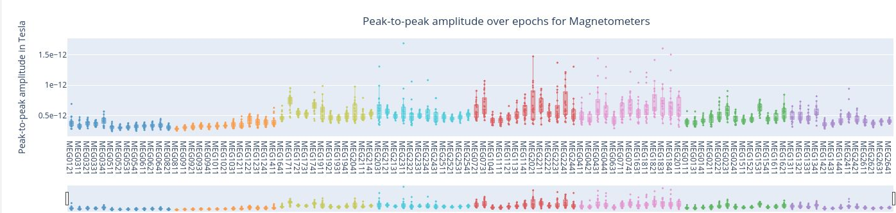

In this plot, each box plot represents a specific sensor (color-coded by areas) and each point the PtP Amplitude for that sensor during a specific epoch (time window).  

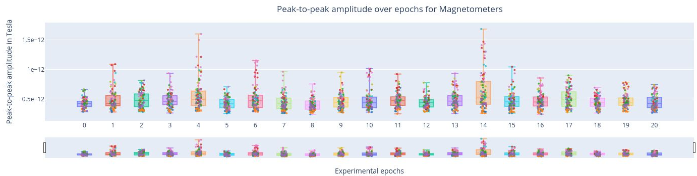

In this plot, each box plot represents an epoch and each point the PtP Ampltiude of the sensors during that specific time window.  

### ECG: heart beat interference

Heartbeat interference is a common source of noise in MEG recordings. This intereference shows up as a rhythmic and periodic fluctuation, and it varies among participants (Gapontseva, 2023). 

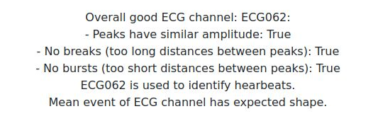

First, we have a short overview with key criteria about the ECG signal recorded. MEGqc evaluates whther the heartbeats were recordnd in a consistently (similar amplitude), without missing beats (no breaks) and without false detections (no bursts). These aspects are relevant for determining if the channel issuitable heartbeat artifact identification. 

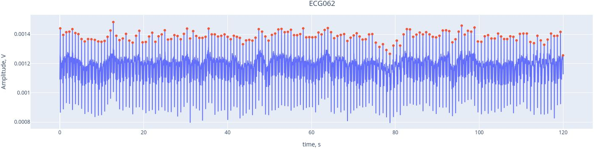

Here, we see the ECG signal (blue line) captured by the ECG channel (_ECG062_), with the red marking the R-peaks of each heartbeat. The R-peaks are components of the electrical activity of the heartbeat, and they can be easily used as reference points to identify heartbeat intereference.
THanks to the interactive features, you can activate or deactivate the ECG signal and the peaks by clicking on the legend. YOu may alzo  zoom in by selecting a section within the figure.

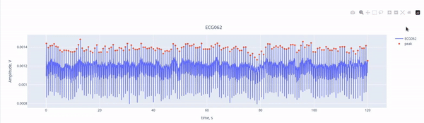

The mean recorded R wave (from the ECG channel, real heartbeats) was shifted to align the _ECG signal found on MEG channels_. This alignment helps us understand the extend to which the hearbeats influence he MEG channels. Then, a Pearson correlation is performed between the _ECG signal found in each MEG channel_ and the reference mean signal of the ECG.

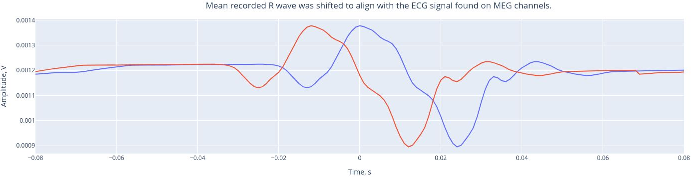

The following 3 plots highlights the MEG channels affected by heartbeat interference. Each line representes one MEG sensor, colour-coded by region. The plots are ordered from the most affected to the least affected. 

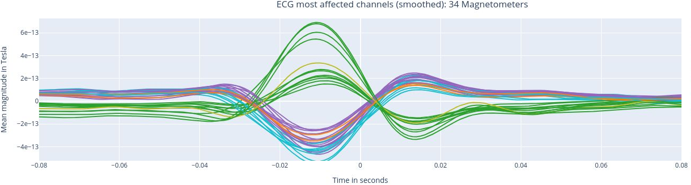
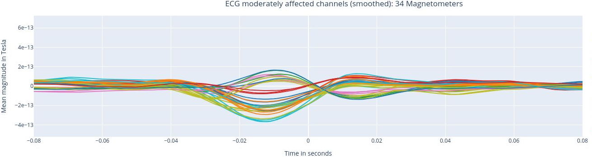
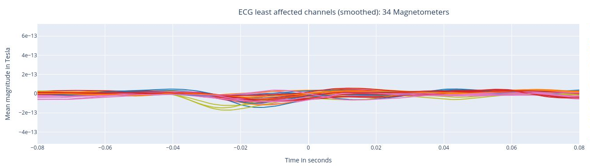

The interactive feature allows you to hide (1 click) and isolate (2 clicks) specific groups of sensors, as well as zoom-in on certai sections of the figure.

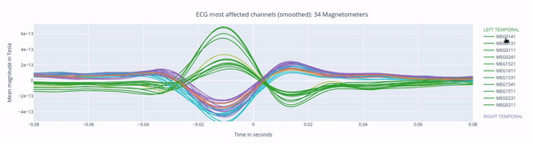

### EOG: eye movement interference

The EOG (Electrooculogram) sensor records eye activity and is used to detect eye movements, which are usually separated into saccades and blinks. The MNE algorithms, however, only identify blinks (Gapontseva, 2023).

This plot shows the EOG signal over time (blue line). Each blink produces a peak, marked by a red dot. An averaged eye-blink event is expected to have a wave-like shape with one main crest. If no such shape is detected in most of the data files in a set, the EOG channel is marked as "bad". 

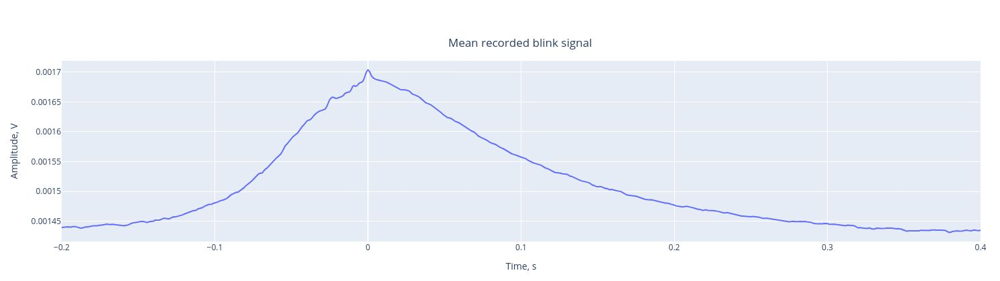

This plot represents the mean event shape, which indicates the typical waveform of a blink as captured by the EOG channel. This allows us to understand how blinks influence MEG sensors. 

Similar to the ECG report, the following three plots show the MEG channels affected by blink artifacts, ranked from the most affected to the least affected. This help us to identify channels that may require artifact correction before analysis.

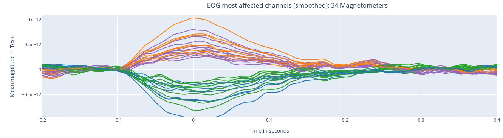
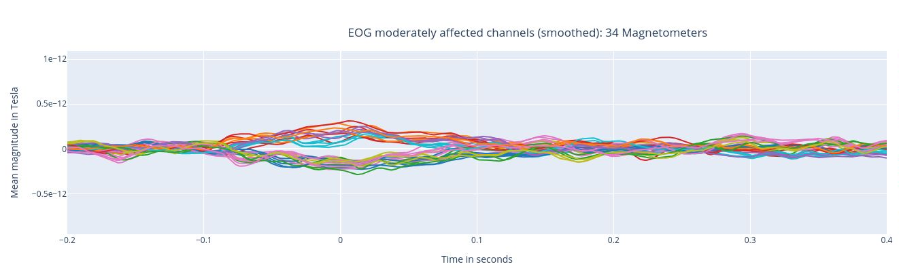
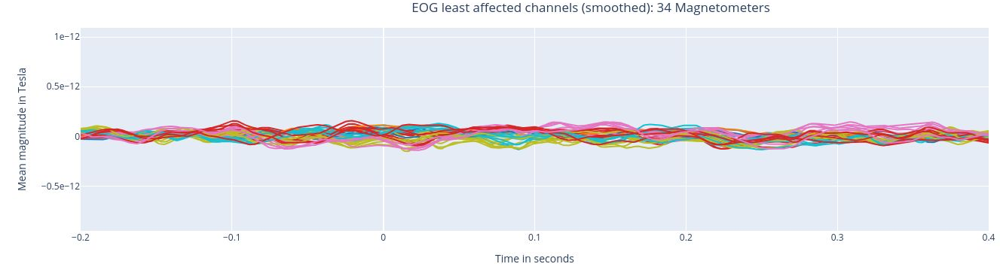

### High frequency (Muscle) artifacts
Muslce contractions generate electrical activity noticeable in the range of 110-140 Hz (as suggested by MNE). Examples include clenching the jaw, swallowing or twitching cranial muscles (Gapontseva, 2023).

This report includes a single plot displaying the z-scores of high frequency (blue line) and events (red-dots) where the z-score exceed the threshold of 5 (default in settings)

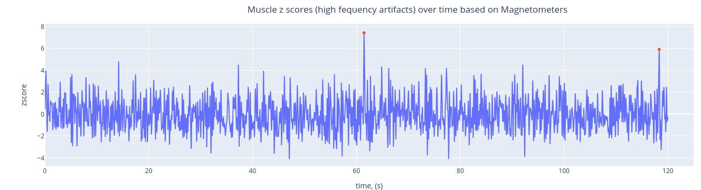

### Estimation of subjet's head movement
These movements may appear as sudden shifts or jumps in the MEG data, causing distortions in the spatial distribution of the recorded magnetic fields. The effects of head movements can vary depending on the strength and direction Gapontseva, 2023).
This module is implemented but requires a substantial amount of information to perform the calculation.